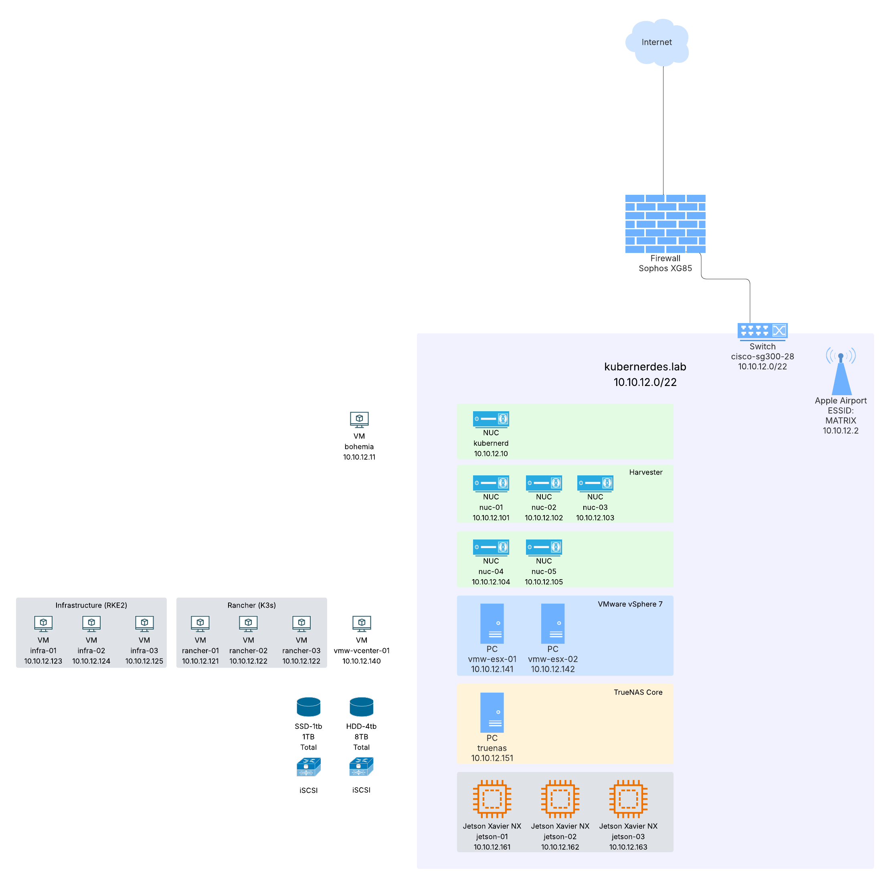

# README

Kubernerdes.lab is my Lab/Demo environment using commodity "homelab" type gear.  It began a while ago and is undergoing a transformation as I now work @SUSE after working at AWS for a few years.

## Products

* SUSE Linux Enterprise Server (aka SLES)
* SUSE Linux Micro (aka SL-Micro, fka SLE-Micro)
* SUSE Multi-Linux Manager (fka SUSE Manager)
* SUSE Rancher
* SUSE Rancher Kubernetes Engine 2 (aka RKE2)
* SUSE Virtualization (SUSE Harvester)
* SUSE Security (fka Neuvector)
* SUSE Observability (fka StackState)
* SUSE AI 
* SUSE Edge
* SUSE Private Registry 
* VMware vSphere 
* freeNAS

## Architecture

## References
